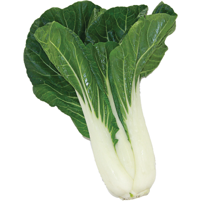

#   Cabbage Collector 

Play here: https://sharpevb.github.io/Cabbage-Collector/

##  Background 
So you're sitting there, wondering what to make for you annual work cookout. We've all been there, right? As you scroll allrecipes or Food Network, it dawns on you: your meemaw's famous fermented cabbage recipes! But she used to make four different kinds, how could you possibly choose just one?

##  How to Play
In order to impress your coworkers, you need to collect as many cabbages needed to start your dishes. 

A random number will be shown at the start of the game. Clicking a cabbage will add a specific amount of leafy goodness to your current number of cabbages. You win the game by matching your total cabbages to the random number, thus cooking the perfect recipe and you are the envy of everyone! You lose if you go over the random number, thus cooking too much and eating leftovers for the next week. 

Be warned, the value of each cabbage is hidden from you until you click on it! Each time the game starts, the cabbage's values will change.

##  Technologies Used
HTML, CSS, Bootstrap, JQuery

##  Demo

### Thanks so much for playing!
Play here: https://sharpevb.github.io/Cabbage-Collector/
